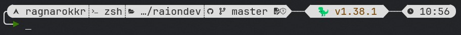

# Dotfiles

My personal dotfiles: a Perennial Work in Progress. Will it ever find an end? 🤣

## Requirements

- [Windows Subsystem for Linux Version 2][wsl]. (Most should work on bare Linux, but not everything.)
- [ArchLinux][archlinux]
- Zsh
- [Starship][starship]

## Install

Cloning the repo on the hard drive:
```shell
git clone https://github.com/Ragnarokkr/dotfiles.git ~/.dotfiles
cd ~/.dotfiles
./install.zsh
```
Or, if not interested into versioning, download and unzip it:
```shell
curl -LO https://github.com/Ragnarokkr/dotfiles/archive/refs/heads/master.zip
unzip master.zip
rm -fr dotfiles-master/.git*
mv dotfiles-master ~/.dotfiles
cd ~/.dotfiles
./install.zsh
```

## Customizing packages

To add or remove packages from the installation, edit the `packages.list` file. Each row specifies a package to install using one of the following patterns:

- `packager:package`
- `packager:package:command`
- `packager:package:dir_path`

| id         | desc                                                                                                               |
| ---------- | ------------------------------------------------------------------------------------------------------------------ |
| `packager` | is the name of the package manager to use for the installation. (Only `pacman` and `nix` are supported.)           |
| `package`  | is the name of the package to pass to the package manager.                                                         |
| `command`  | is the name of the command provided by the package to be searched, checking if the package needs to be installed.  |
| `dir_path` | is an unique directory path provided by the package to be searched, checking if the package needs to be installed. |

## Installing Steps

| #   | action                     | destination        | desc                                                                            |
| --- | -------------------------- | ------------------ | ------------------------------------------------------------------------------- |
| 1   | create `.dotfilesrc`       | `$HOME`            | Contains variables used by the installer itself. It must be sourced in `.zshrc` |
| 2   | check `packages.list`      |
| 3   | symlink files in `zsh`     | `$HOME`            | shell configuration files                                                       |
| 4   | symlink files in `config`  | `$HOME/.config`    | configuration files                                                             |
| 5   | copy files in `config`     | `$HOME/.config`    | configuration files which expects sensible private data                         |
| 6   | symlink files in `private` | `$HOME/.config`    | private configuration files                                                     |
| 7   | symlink files `local/bin`  | `$HOME/.local/bin` | custom commands                                                                 |
| 8   | install **Nix**            |                    | install **Nix Package Manager**                                                 |
| 9   | install packages           |                    | install packages defined in `packages.list`                                     |
| 10  | run scripts in `setup`     |                    | run auxiliary setup scripts for the installed packages                          |

> [!NOTE]
> `private` directory is a submodule to a private git repo. 

## Shell Prompt

The shell prompt is provided with both a light and dark theme. The prompt is subdivided into three areas: the left side for system-related information, the center area for package and language information, and the right area for process, time, and extra information.

### Palette

#### Light

| Name         |                        Color                        | Name        |                        Color                        | Name       |                        Color                        |
| ------------ | :-------------------------------------------------: | ----------- | :-------------------------------------------------: | ---------- | :-------------------------------------------------: |
| `left_fg`    | ${\colorbox{333333}{\textcolor{dddddd}{\#333333}}}$ | `center_fg` | ${\colorbox{333333}{\textcolor{dddddd}{\#333333}}}$ | `right_fg` | ${\colorbox{333333}{\textcolor{dddddd}{\#333333}}}$ |
| `left_bg`    | ${\colorbox{dddddd}{\textcolor{333333}{\#dddddd}}}$ | `center_bg` | ${\colorbox{dddddd}{\textcolor{333333}{\#dddddd}}}$ | `right_bg` | ${\colorbox{dddddd}{\textcolor{333333}{\#dddddd}}}$ |
| `success`    | ${\colorbox{367a02}{\textcolor{dddddd}{\#367a02}}}$ | `alert`     | ${\colorbox{7a0202}{\textcolor{dddddd}{\#7a0202}}}$ |
| `versioning` | ${\colorbox{7a4602}{\textcolor{dddddd}{\#7a4602}}}$ |
| `lines`      | ${\colorbox{dddddd}{\textcolor{333333}{\#dddddd}}}$ |

#### Dark

| Name         |                        Color                        | Name        |                        Color                        | Name       |                        Color                        |
| ------------ | :-------------------------------------------------: | ----------- | :-------------------------------------------------: | ---------- | :-------------------------------------------------: |
| `left_fg`    | ${\colorbox{a0a9cb}{\textcolor{333333}{\#a0a9cb}}}$ | `center_fg` | ${\colorbox{a0a9cb}{\textcolor{333333}{\#a0a9cb}}}$ | `right_fg` | ${\colorbox{a0a9cb}{\textcolor{333333}{\#a0a9cb}}}$ |
| `left_bg`    | ${\colorbox{1d2230}{\textcolor{dddddd}{\#1d2230}}}$ | `center_bg` | ${\colorbox{1d2230}{\textcolor{dddddd}{\#1d2230}}}$ | `right_bg` | ${\colorbox{1d2230}{\textcolor{dddddd}{\#1d2230}}}$ |
| `success`    | ${\colorbox{9be342}{\textcolor{333333}{\#9be342}}}$ | `alert`     | ${\colorbox{e34242}{\textcolor{dddddd}{\#e34242}}}$ |
| `versioning` | ${\colorbox{e37842}{\textcolor{333333}{\#e37842}}}$ |
| `lines`      | ${\colorbox{a0a9cb}{\textcolor{333333}{\#a0a9cb}}}$ |

### Format

| Side   | Modules                                                                                                                                                                           |
| ------ | --------------------------------------------------------------------------------------------------------------------------------------------------------------------------------- |
| Left   | `$os`, `$sudo`, `$username`, `$hostname`, `$container`, `$docker_context`, `$shell`, `$shlvl`, `$nix_shell`, `$directory`, `$git_branch`, `$git_commit`, `$git_status`, `$status` |
| Center | `$custom.dotenv`, `$bun`, `$c`, `$dart`, `$deno`, `$golang`, `$java`, `$lua`, `$meson`, `$nodejs`, `$package`, `$python`, `$rust`, `$zig`                                         |
| Right  | `$jobs`, `$cmd_duration`, `$time`                                                                                                                                                 |

### Preview

**Light**


**Dark**


<!-- references -->

[wsl]: https://learn.microsoft.com/en-us/windows/wsl/install-manual
[archlinux]: https://geo.mirror.pkgbuild.com/iso/latest/
[starship]: https://starship.rs/